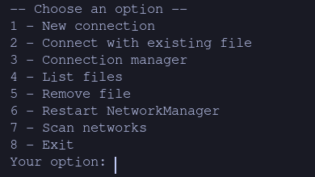
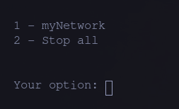
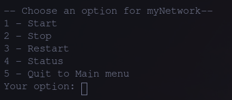
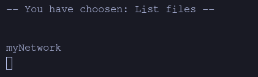
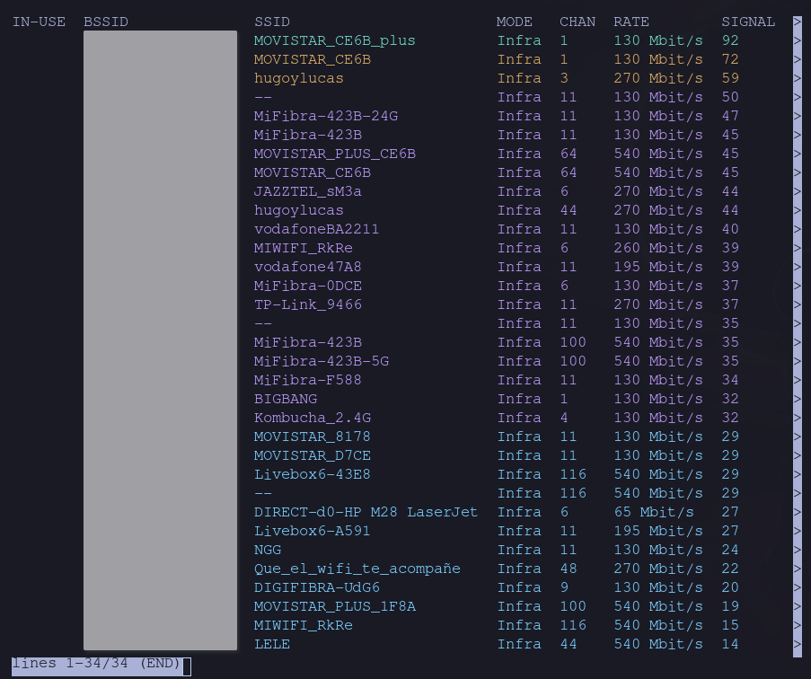

# Wifi-Network-Manager

We all know that when you are a beginner connecting to a network via Wi-Fi in Linux
it's a very hard task, this script made in bash allows you to manage your entirely 
Wi-Fi connection. With this script you can do:

- Creating a new Wi-Fi connection
- Connect with an existing file
- Manage your connections
  - Start
  - Stop
  - Restart
  - Status
- Know how many files of connection you have
- Remove any connection file you want
- Restart NetworkManager (usefull for example to execute Spotify)
- Scan nearby connections

This script has been made in __Arch Linux__, that means it will work perfectly in the same OS where it was created

# Explanation

The explanation will be divided in two parts: Requiere knowldege of the script and 
Explanation of the script:

### Require knowldege

This script work with many different services (see requirements), but there's one
that is very special: __netctl__. This service works with files that storage the
name of networks (ESSID) and the passwords of it. The connection via Wi-Fi is made
by those files.

### Script explanation

  

__1. New connection__  

  - When you select "New connection" you will have to fill 3 sections: "File name", "Connection name (EESID)" and "Connection password".
    - File name --> Insert a name to named your connection file
    - Connection name --> Insert the EESID of your network connection
    - Connection password --> Insert the network connection password
  - When all of these steps are done your file will be created, you can check it listing the directory: /etc/netctl or selecting "4. List files"

  Menu: of 1. Create file  
  
  

__2. Connect with existing file__
  - In this selection you will have to choose what connction file do you want to start
  - You can list the directory inserting "y"

Menu: 2. Connect with existing file  


__3. Connection manager__
  -  In this script the "connection manager" is very important because is the manager of all the connection files, with this manager you can Start/Stop/Restart/Status your connection files, also you can stop all files running

Image: Connection manager main menu



Image: Action to connection files



__4. List files__

  - Instead of listing via shell the directory /etc/netctl the script can do it for you

Image: List connection files



__5. Remove files__

  - As well happend in the section number 4 (List files) you can remove those files
  via script instead of shell

Image: Remove files


__6. Restart NetworkManager__

  - This section is very usefull for example if you want to open Spotify, basically turns all commands you should type to restart this service in just one insert of key

Image: NetworkManager succesfully restarted


__7. Scan networks__

  - If you don't know how to know what are your available connections to connect, no worries just insert the 7 key, it will appear all connections with there BSID, Name (SSID), Mode, Channel, Speed of connections, Signal, bars of signal and they're security

Image: All availables connections around me



# Installation

In order to run the script without any issues you will have to install 4 packages:

  - netctl
  - wireless-tools
  - net-tools
  - networkmanager

#### Arch Linux

```
sudo pacman -S netctl wireless-tools net-tools networkmanager git
sudo systemctl enable NetworkManager.service
sudo systemctl enable wpa_supplicant.service
git clone https://github.com/vicprzram/Wifi-Network-Manager
sudo chmod -R Wifi-Network-Manager
sudo bash Wifi-Network-Manager/wifiNetworkManager.bash
```

#### Debian

```
sudo apt install netctl wireless-tools net-tools networkmanager git
sudo systemctl enable NetworkManager.service
sudo systemctl enable wpa_supplicant.service
git clone https://github.com/vicprzram/Wifi-Network-Manager
sudo chmod -R Wifi-Network-Manager
sudo bash Wifi-Network-Manager/wifiNetworkManager.bash
```

```


____   ____.__        __                 __________                             
\   \ /   /|__| _____/  |_  ___________  \______   \ ___________   ____ ________
 \   Y   / |  |/ ___\   __\/  _ \_  __ \  |     ___// __ \_  __ \_/ __ \\___   /
  \     /  |  \  \___|  | (  <_> )  | \/  |    |   \  ___/|  | \/\  ___/ /    / 
   \___/   |__|\___  >__|  \____/|__|     |____|    \___  >__|    \___  >_____ \
                   \/                                   \/            \/      \/


```
This project is licensed under the terms of the Apache License 2.0
